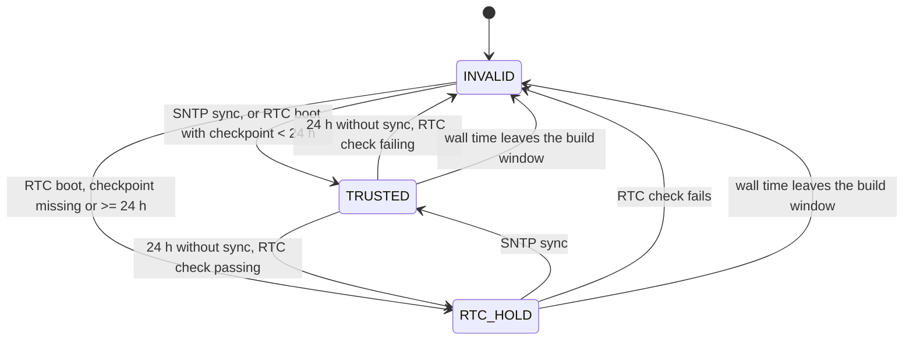

# Time

This is the contract for how the device obtains, judges and presents time.
Board-level RTC power facts are in [hardware notes](hardware_notes.md#rtc-power-and-verification-boundary).

## Overview

SNTP, or at boot the PCF85063A RTC, sets the ESP32 system clock. A
monotonic-time trust policy turns that clock into one **time state**:
INVALID, TRUSTED or RTC_HOLD. The time state alone decides two things:

- whether the face shows time fields or masks them;
- whether [events](events.md) run.

The face draws every time scale from the same `unix_ms` snapshot.

## Time scales

Time-scale arithmetic uses integer milliseconds in `common/time_model.c`.

- **UTC:** civil time and the ISO week are UTC.
- **TAI:** MJD on the TAI scale uses TAI = UTC + TAI−UTC.
- **GPS:** GPS week and time-of-week use GPS−UTC = TAI−UTC − 19 s.

TAI−UTC comes from a verified `time/leap-seconds.list` when one is
installed. Otherwise the built-in current-era value of 37 s applies. The
table and the local offset are both carried in `clock_model_t` for each
frame.

The leap table uses the IERS/IETF format. A table is used only when its
`#$` update, `#@` expiry and `#h` SHA-1 lines are present, the hash
matches, and every entry changes TAI−UTC by one second at a later instant.
The hash detects file damage; it does not authenticate the source.

- **Selection:** among the verified SD and flash tables, the latest `#$`
  update wins, with SD winning a tie. With none, the built-in value
  applies.
- **Reselection:** uploads, deletes, `leap reload`, config reloads and
  volume mount changes reselect the table. The file rules are in
  [storage](storage.md#managed-files).
- **Expiry:** an expired table keeps its last TAI−UTC value. `/status` and
  `leap status` judge expiry only while time is valid. The face does not
  yet mark an expired or missing table.

## Local time

Local time comes from a POSIX TZ rule (`common/tz_rule.c`), evaluated at
each frame's instant. Daylight-time rules therefore apply without zoneinfo
files.

- Examples: `CST-8`, `<+0530>-5:30`, `CET-1CEST,M3.5.0,M10.5.0/3`.
- POSIX offsets count **west** of UTC. Offsets must be whole minutes within
  ±14 hours. A daylight-time rule must name both transition dates.
- The CLI `±HH:MM` form and the legacy config key `tz_offset_minutes` count
  **east** of UTC. They are converted to a fixed rule such as `<+08>-8`.

Priority: the RAM-only CLI `tz` override first, then the selected config
(`tz`, else `tz_offset_minutes`), then the default `<+08>-8`.

## Time sources

SNTP runs on lwIP's client. Full RFC 5905 NTP and xleave are out of scope.

1. Manual `ntp server` CLI override (RAM-only).
2. The selected config's `ntp_server`.
3. DHCP option 42. The lease's list is captured through the linker wrap
   `--wrap=dhcp_set_ntp_servers`, independently of the active table.
4. `pool.ntp.org` (plus `time.google.com` when more slots are configured).

A DHCP server that fails to sync within about 18 s yields to the pool, and
DHCP is retried every five minutes. All SNTP operations run on
`tcpip_thread`.

Sync history uses monotonic time. The active source is **fresh** for two
hours after a successful sync. Changing server or reconnecting does not
erase a still-valid last-good sync.

## Time state

`clock_state_t` in `common/clock_health.h`:

| State | Condition | Face | Events |
| --- | --- | --- | --- |
| INVALID | No usable time source this boot; wall time outside the build window; or the RTC check fails after 24 h without a sync | Time fields masked | Do not run |
| TRUSTED | Synchronized within the last 24 h, including an RTC boot whose NVS checkpoint is under 24 h old | Shown | Run |
| RTC_HOLD | Over 24 h without a sync, or an RTC boot with a missing or older checkpoint, while the RTC cross-check passes | Shown | Run |

### Plausibility window

Wall time must lie within [build time, build time + 10 years]. Outside it,
the state is INVALID regardless of anything else.

- **Build time:** `RLCD_BUILD_EPOCH`, set by CMake at configure time for
  both host and firmware. `SOURCE_DATE_EPOCH` can pin it for reproducible
  builds. A stale value only widens the window.
- **Where it is checked:**
  1. **SNTP results.** `sntp_mgr` overrides lwIP's weak `sntp_sync_time()`.
     An implausible result is counted in `rejected` and never sets the
     clock or the trust state. This also guards against a bad DHCP option-42
     server.
  2. **The RTC at boot.**
  3. **The running system clock**, each time the state is evaluated.

## RTC

The PCF85063A sits on the shared I²C bus.

- **Writing after a sync:** after each SNTP sync, the RTC task writes the
  time. It first invalidates the application RAM marker, writes the time,
  reads it back to verify, and only then restores the marker. The lwIP
  callback itself does no I²C or NVS work.
- **NVS checkpoint:** a bounded last-sync time in NVS, updated at most
  every 6 h. NVS holds nothing else.
- **At boot:** a usable RTC sets the system clock. Usable means the
  oscillator-stop flag is clear, the calendar is valid, the application
  marker is present, and the time is inside the build window.
  - With a checkpoint under 24 h old, the state is TRUSTED. This is not
    counted as an SNTP sync or a fresh source.
  - Otherwise it is RTC_HOLD.
  - If the RTC is not usable, the state stays INVALID until SNTP succeeds.
- **Cross-check:** runs every minute in the RTC task. It passes when the
  RTC is usable as above and differs from the system clock by no more than
  max(60 s, 50 ppm × the time since the two clocks were last aligned). They
  are aligned by a verified RTC write after SNTP, or when the RTC sets the
  clock at boot. RTC_HOLD lasts only while the check passes.

The board has no RTC backup cell. A full power loss stops the RTC
oscillator, so the next boot is INVALID until SNTP succeeds.

## Display

The face masks date, time, UTC, ISO week, MJD and GPS fields only while the
time state is INVALID. The top-bar label adds detail:

| Label | Time state | Meaning |
| --- | --- | --- |
| `NTP OK` | TRUSTED | The current source synced within 2 h. |
| `HOLDOVER` | TRUSTED | The last sync was 2–24 h ago and Wi-Fi is up. |
| `WIFI LOST` | TRUSTED | Wi-Fi is down. |
| `RTC HOLD` | RTC_HOLD | Over 24 h without a sync. |
| `SYNC...` or `BOOT UNS` | INVALID | Waiting for the first time source. |
| `TIME UNS` | INVALID | Time was obtained but has since failed its checks. |

## Diagnostics

- `ntp status`: source, servers, age, fresh, time state and rejected
  results.
- `rtc status`: present, oscillator stop, marker, calendar, checkpoint, boot
  use, and the last cross-check (system − RTC difference, and time since the
  clocks were aligned).
- `tz`: the effective rule and its source.
- `leap status`: the selected table, its expiry and the current TAI−UTC.
- `GET /status`: the `sntp` object reports `time_state`, `trusted`, `valid`
  and `rejected`; the `tz` and `leap` objects report the same values as the
  CLI.

## Verification boundary

- **Host tests only:** some transitions take more than 24 h, or need the RTC
  powered off, so they are covered by host tests rather than reproduced on
  hardware:
  - TRUSTED → RTC_HOLD and RTC_HOLD/TRUSTED → INVALID;
  - rejection of out-of-window SNTP results;
  - the RTC drift tolerance.
- **Verified on hardware:** an RTC boot without a checkpoint (RTC_HOLD),
  and an RTC boot with a recent checkpoint (TRUSTED).
- **Not yet measured:** RTC drift and true power-loss retention; see the
  [implementation notes](../rlcd_time_scale_monitor_implementation_notes.md).
